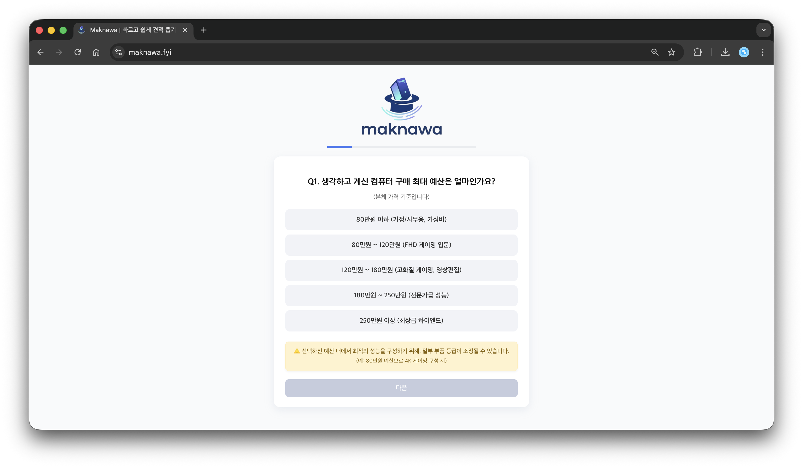
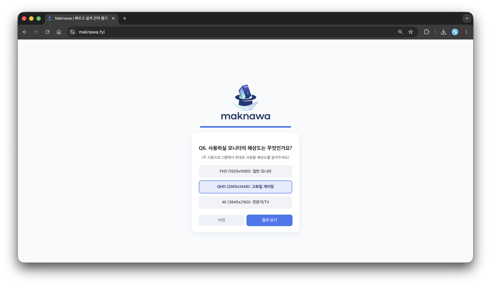
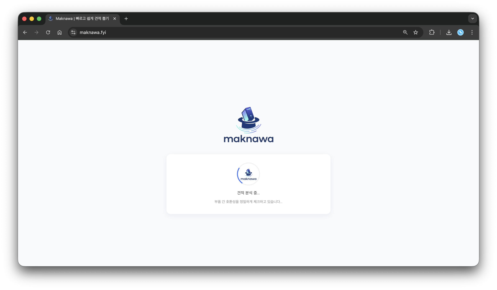
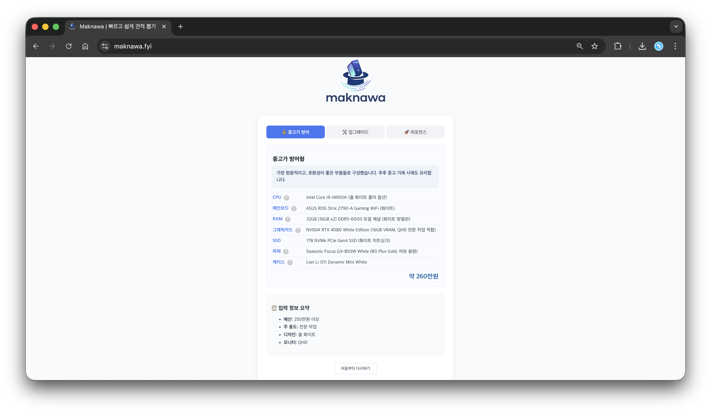
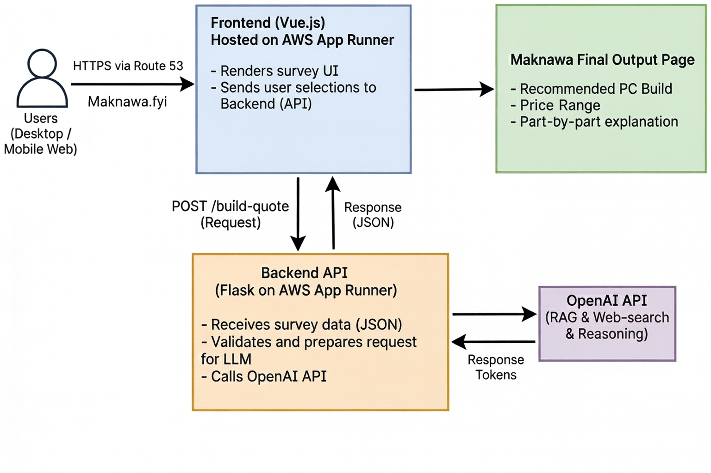
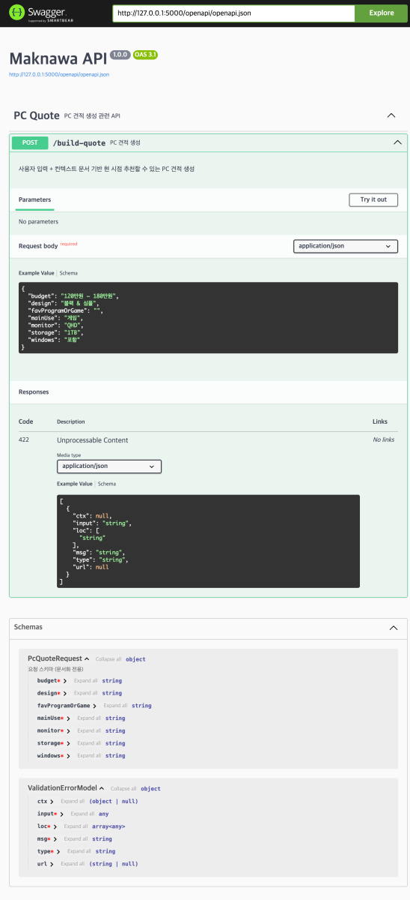

<p align="center">
  
  
  
  
  
  
  
  
</p>


<div align="center">
  <h1>Maknawa – AI 기반 PC 견적 추천 서비스</h1>

  

<p>
  <a href="https://maknawa.fyi" style="font-size: 16px; font-weight: bold; padding: 8px 16px;">
     Maknawa Web Service
  </a>
</p>

</div>


## 화면 미리보기

<table>
  <tr>
    <td align="center"><strong>메인 화면</strong><br></td>
    <td align="center"><strong>설문 UI</strong><br></td>
    <td align="center"><strong>로딩 화면</strong><br></td>
    <td align="center"><strong>결과 화면</strong><br></td>
  </tr>
</table>


## 프로젝트명
Maknawa – AI 기반 PC 견적 추천 서비스
“예산·용도만 입력하면, AI가 최적의 PC 견적을 자동 생성해주는 서비스”

## 데모 / 배포 주소
- Web: https://maknawa.fyi
- Backend(AWS App Runner): (자동 HTTPS)

## 프로젝트 소개
Maknawa는 사용자가 예산, 용도, 선호 프로그램만 선택하면 AI가 RAG 기반 지식과 부품 선택 기준을 바탕으로 **최적의 데스크탑 PC 견적**을 자동 생성해주는 웹 서비스이다.

## 기획 의도
조립 PC는 동일한 성능 대비 비용 효율이 높아 많은 사용자가 선호하지만, 실제 견적을 구성하는 과정은 높은 진입 장벽이 존재합니다.
CPU·GPU 규격, 칩셋·소켓 호환성, 전력·TDP 계산, 가격 대비 성능 판단 등 전문적인 하드웨어 지식이 요구되기 때문에 일반 사용자가 정확한 견적을 구성하기 어렵다.

이로 인해 다음과 같은 문제가 발생한다:

- 부품 선택 기준 미숙 → **불필요한 비용 지출**
- 규격·소켓 이해 부족 → **호환성 문제**
- 정보량 과다 → **선택 피로 증가**
- 완제품 구매로 귀결되는 **정보 격차 문제**

**Maknawa 프로젝트는 이러한 문제를 해결하기 위해 기획되었다.**

사용자가 단순히 요구사항을 입력하면  
> 예: “배그 잘 돌아가는 100만 원 컴퓨터”, “사무용 50만 원 PC”

AI는 RAG 기반 지식과 선택 기준 문서를 활용하여 해당 요구를 **전문 PC 견적서 형태로 자동 변환한다**.  
복잡한 하드웨어 지식을 학습하지 않아도 예산과 용도 선택만으로 **최적의 조립 PC 견적**을 얻을 수 있도록 구성되어 있다.


## 프로젝트 내용

사용자가 입력한 **예산, 용도, 선호 프로그램, 디자인, 저장 용량 등 핵심 정보**를 기반으로  
가장 적합한 조립 PC 견적을 자동 생성하는 **AI 기반 PC 견적 추천 서비스**이다.

사용자의 입력값은 백엔드 서버에서 정제·분석된 후 OpenAI LLM에 전달되며,  
LLM은 벡터 데이터베이스에 저장된 **선택 가이드 문서**(부품 호환성, 성능 기준, 사용자 요구 조건 매핑)와 서버 프롬프트를 함께 활용하여 최적화된 **AI PC 구성안**을 생성한다.

이 과정에서 CPU/GPU 등급, 성능 요구치, 전력·호환성, 가격 대비 성능 등을 종합적으로 분석하고  
사용자의 목적과 예산에 맞춘 **최적화된 조립 PC 견적**을 생성한다.

---

## 기대 효과

- 일반 사용자도 **전문 지식 없이 안정적인 조립 PC 구성 가능**
- 과소/과대 스펙 구매 방지를 통한 **비용 절감**
- 소비자 중심의 **합리적인 IT 소비 문화 조성**
- PC 구매 의사결정 시간 단축 및 **편의성 향상**

---

## 활용 방안

- AI · 백엔드 · 프론트엔드가 결합된 **풀스택 AI 서비스 구축 경험 확보**
- 4차 산업혁명 시대에 적합한 **AI 프로젝트로 포트폴리오 활용 가치**
- Flask, Vue.js, AWS Cloud 기반의 **실무형 개발 역량 강화**
- 코디세이 교육 과정에서 학습한 기술을 **실제 서비스 수준으로 구현하며 성장 기반 확보**


## 시스템 아키텍처
 

## 사용자 다이어그램
 

## API 명세서



## 주요 기능
<div style="max-width:600px; margin:40px auto; font-family:Arial, sans-serif;">

  <!-- Step 1 -->
  <div style="
    background:#f2f3f5;
    padding:20px 24px;
    border-radius:14px;
    border:1px solid #d5d7db;
    font-size:18px;
    font-weight:600;
    text-align:center;
    color:#2d2d2d;
    margin-bottom:20px;
  ">사용자 입력</div>

  <div style="text-align:center; font-size:26px; color:#8a8f99; margin:10px 0;">↓</div>

  <!-- Step 2 -->
  <div style="
    background:#f2f3f5;
    padding:20px 24px;
    border-radius:14px;
    border:1px solid #d5d7db;
    font-size:18px;
    font-weight:600;
    text-align:center;
    color:#2d2d2d;
    margin-bottom:20px;
  ">Vue.js 설문 UI</div>

  <div style="text-align:center; font-size:26px; color:#8a8f99; margin:10px 0;">↓</div>

  <!-- Step 3 -->
  <div style="
    background:#f2f3f5;
    padding:20px 24px;
    border-radius:14px;
    border:1px solid #d5d7db;
    font-size:18px;
    font-weight:600;
    text-align:center;
    color:#2d2d2d;
    margin-bottom:20px;
  ">Axios API 호출</div>

  <div style="text-align:center; font-size:26px; color:#8a8f99; margin:10px 0;">↓</div>

  <!-- Step 4 -->
  <div style="
    background:#f2f3f5;
    padding:20px 24px;
    border-radius:14px;
    border:1px solid #d5d7db;
    font-size:18px;
    font-weight:600;
    text-align:center;
    color:#2d2d2d;
    margin-bottom:20px;
  ">Flask Backend 처리</div>

  <div style="text-align:center; font-size:26px; color:#8a8f99; margin:10px 0;">↓</div>

  <!-- Step 5 -->
  <div style="
    background:#f2f3f5;
    padding:20px 24px;
    border-radius:14px;
    border:1px solid #d5d7db;
    font-size:18px;
    font-weight:600;
    text-align:center;
    color:#2d2d2d;
    margin-bottom:20px;
  ">RAG 기준 문서 적용(JSON)</div>

  <div style="text-align:center; font-size:26px; color:#8a8f99; margin:10px 0;">↓</div>

  <!-- Step 6 -->
  <div style="
    background:#f2f3f5;
    padding:20px 24px;
    border-radius:14px;
    border:1px solid #d5d7db;
    font-size:18px;
    font-weight:600;
    text-align:center;
    color:#2d2d2d;
    margin-bottom:20px;
  ">OpenAI LLM 견적 생성</div>

  <div style="text-align:center; font-size:26px; color:#8a8f99; margin:10px 0;">↓</div>

  <!-- Step 7 -->
  <div style="
    background:#f2f3f5;
    padding:20px 24px;
    border-radius:14px;
    border:1px solid #d5d7db;
    font-size:18px;
    font-weight:600;
    text-align:center;
    color:#2d2d2d;
    margin-bottom:20px;
  ">최종 PC 구성안 반환</div>

</div>


## 기술 스택
**Frontend**
- Vue.js 3
- Vite
- Axios
- TailwindCSS (일부 UI 레이아웃)

**Backend**
- Python 3.12
- Flask
- Flask-CORS
- OpenAI API / RAG 기반 프롬프트 엔지니어링

**Infra/DevOps**
- AWS EC2 (Docker Build Host)
- AWS ECR (이미지 저장소)
- AWS App Runner (Backend·Frontend 배포)
- AWS Route 53 (도메인, DNS 관리)
- Amazon Certificate Manager (HTTPS 인증)
- Docker – Backend/Frontend 컨테이너 이미지화
- GitHub + Git CLI 기반 버전 관리

## 📂 프로젝트 구조
```bash
/ubuntu/project/
├── README.md                     # 프로젝트 개요 / 실행 방법 / 기술 스택 문서
│
├── backend/                      # Flask 기반 API 서버
│   ├── Dockerfile                # Backend 컨테이너 이미지 설정
│   ├── app.py                    # Flask 메인 엔트리포인트·API 라우팅
│   │
│   ├── data/                     # RAG·AI 견적 산출을 위한 정형화 데이터
│   │   ├── compatibility.json    # 소켓 규격·전력 요구량 부품 호환성 규칙
│   │   ├── cpu.json              # CPU 스펙·성능 정보
│   │   ├── gpu.json              # GPU 스펙·성능·TDP 정보
│   │   ├── price_allocation.json # 예산-부품별 가격 비중 계산 규칙
│   │   ├── psu.json              # 파워서플라이(PSU) 용량·등급 정보
│   │   └── ram.json              # 메모리 용량·속도·세대별 정보
│   │
│   ├── openapi.json              # API 스펙 문서(Swagger/OpenAPI)
│   ├── requirements.txt          # Python 의존성 패키지 목록
│   └── setup.py                  # 패키지 세팅(배포/빌드 시 필요한 메타 정보)
│
├── docs/                         
│   ├── api-doc.png               # API 요청/응답 예시 및 엔드포인트 문서
│   ├── system-architecture.png   # 시스템 아키텍처
│   └── user-diagram.png          # 사용자 흐름 다이어그램
│
└── frontend/                     # Vue.js 기반 클라이언트 앱
    ├── Dockerfile                # Frontend 컨테이너 이미지 설정
    ├── README.md                 # UI 실행 설명 및 로컬 개발 가이드
    ├── index.html                # 앱 루트 HTML·Vite 진입점
    ├── jsconfig.json             # VSCode·Vue 개발 환경 설정
    ├── package-lock.json         # npm 패키지 버전 고정 파일
    ├── package.json              # Frontend 의존성 / 스크립트 / 프로젝트 메타 정보
    │
    ├── public/
    │   └── favicon.png           # 브라우저 탭 아이콘
    │
    ├── src/                      # Vue.js 코드
    │   ├── App.vue               # 전체 앱의 루트 컴포넌트
    │   ├── assets/               # 이미지·CSS 정적 자원
    │   ├── components/           # 설문 UI 모듈화 컴포넌트
    │   └── main.js               # Vue 앱 초기화 및 마운트 코드
    │
    └── vite.config.js            # Vite Dev/Build 설정 (Proxy, Port)
```

## 팀 정보 & 컨트리뷰터
| Name    | Role             | Responsibilities                                          |
| ------- | ---------------- | --------------------------------------------------------- |
| **송영준** | Frontend(Vue.js) | UI 개발,UX 구성, 설문 페이지 구현                      |
| **김대웅** | Backend(Flask)   | API 서버, RAG 문서 설계, 견적 생성 파이프라인                  |
| **권창범** | Infra / DevOps   | AWS 인프라 설계·배포(Docker/ECR/AppRunner), 도메인·HTTPS 연결, 운영 자동화 |


## License
This project is licensed under the MIT License.
